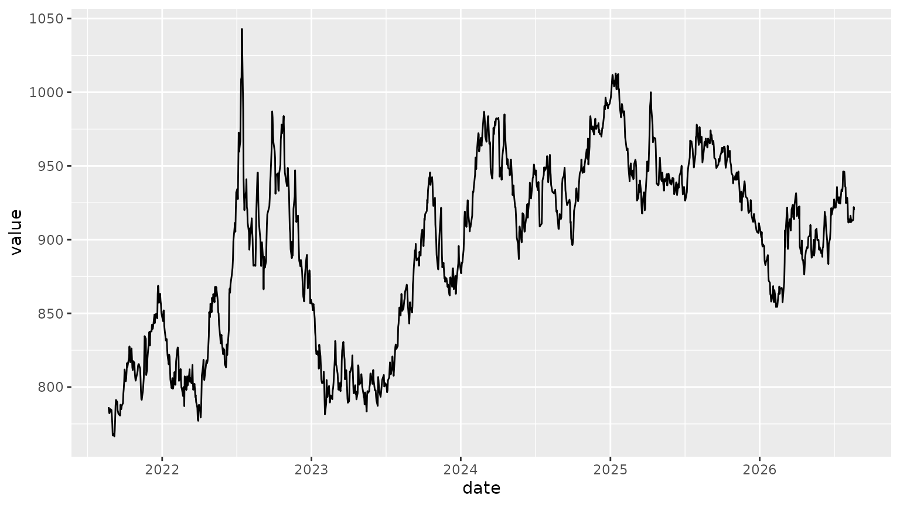
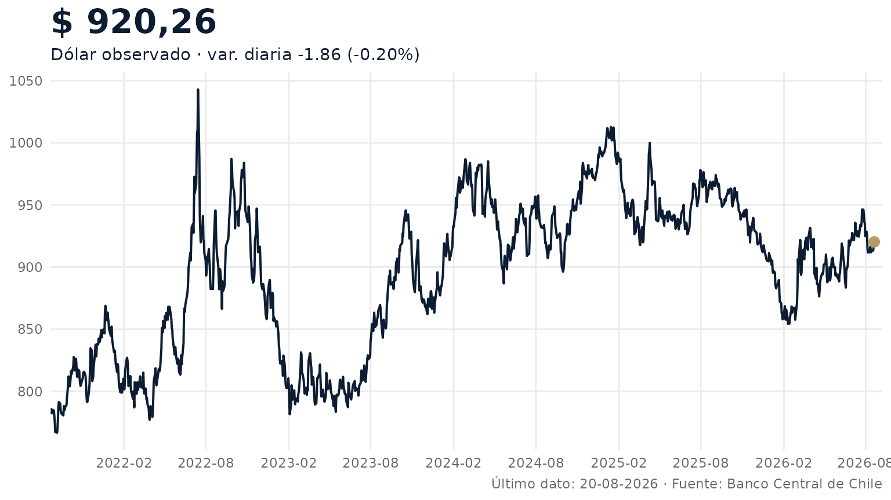

# Visualización con ggplot2

`bcchr` devuelve tibbles normales. Esa decisión permite usar la serie
directamente con `ggplot2`, sin clases especiales ni métodos de gráfico
obligatorios.

Los ejemplos de esta página consultan la API del Banco Central y
requieren que `BCCH_TOKEN` esté configurado. Si no existe el token, el
código se muestra pero no se ejecuta al construir la vignette.

## Descargar una serie

Usaremos el dólar observado y una ventana de cinco años. El código de la
serie es exacto; cuando no lo conozca puede encontrar candidatos con
[`resolve_series()`](https://jkunst.com/bcchr/reference/resolve_series.md).

``` r

library(bcchr)

# Requiere BCCH_TOKEN configurado.
dolar <- get_series(
  "F073.TCO.PRE.Z.D",
  from = Sys.Date() - 365 * 5,
  to = Sys.Date()
)

dolar <- dolar[
  dolar$status_code == "OK" & !is.na(dolar$value),
  c("date", "value")
]

tail(dolar)
#> # A tibble: 6 × 2
#>   date       value
#>   <date>     <dbl>
#> 1 2026-08-13  912 
#> 2 2026-08-14  913.
#> 3 2026-08-17  913.
#> 4 2026-08-18  914.
#> 5 2026-08-19  922.
#> 6 2026-08-20  920.
```

## La opción rápida

[`plot_series()`](https://jkunst.com/bcchr/reference/plot_series.md)
sirve para una inspección inmediata. Es deliberadamente pequeño: recibe
la salida de
[`get_series()`](https://jkunst.com/bcchr/reference/get_series.md) y
devuelve un objeto `ggplot`.

``` r

plot_series(dolar)
```



## Personalizar el gráfico

El antiguo dashboard de indicadores financieros usaba una idea simple y
útil: mostrar historia reciente, destacar el último valor y acompañarlo
con la variación y la fecha del último dato. Podemos conservar esa
lógica con un `ggplot` estático y muy poco código.

``` r

last <- tail(dolar, 1)
last_two <- tail(dolar$value, 2)
change <- diff(last_two)
change_pct <- change / last_two[1]

last_value <- formatC(
  last$value,
  format = "f",
  digits = 2,
  big.mark = ".",
  decimal.mark = ","
)

subtitle <- sprintf(
  "Dólar observado · var. diaria %+.2f (%+.2f%%)",
  change,
  100 * change_pct
)

ggplot2::ggplot(dolar, ggplot2::aes(date, value)) +
  ggplot2::geom_line(
    linewidth = 0.7,
    colour = "#0c1c32"
  ) +
  ggplot2::geom_point(
    data = last,
    size = 2.8,
    colour = "#b69b68"
  ) +
  ggplot2::scale_x_date(
    date_breaks = "6 months",
    date_labels = "%Y-%m",
    expand = ggplot2::expansion(mult = c(0, 0.01))
  ) +
  ggplot2::labs(
    title = paste("$", last_value),
    subtitle = subtitle,
    x = NULL,
    y = NULL,
    caption = paste(
      "Último dato:", format(last$date, "%d-%m-%Y"),
      "· Fuente: Banco Central de Chile"
    )
  ) +
  ggplot2::theme_minimal(base_family = "sans") +
  ggplot2::theme(
    panel.grid.minor = ggplot2::element_blank(),
    plot.title = ggplot2::element_text(
      size = 22,
      face = "bold",
      colour = "#0c1c32"
    ),
    plot.subtitle = ggplot2::element_text(colour = "#0c1c32"),
    plot.caption = ggplot2::element_text(colour = "#666666"),
    axis.text = ggplot2::element_text(colour = "#666666")
  )
```



La paleta usa el navy y el dorado del sitio de `bcchr`, pero los datos
siguen siendo un tibble común. Para otro indicador basta cambiar el
`series_id` y, si corresponde, adaptar el formato del eje o del último
valor.
