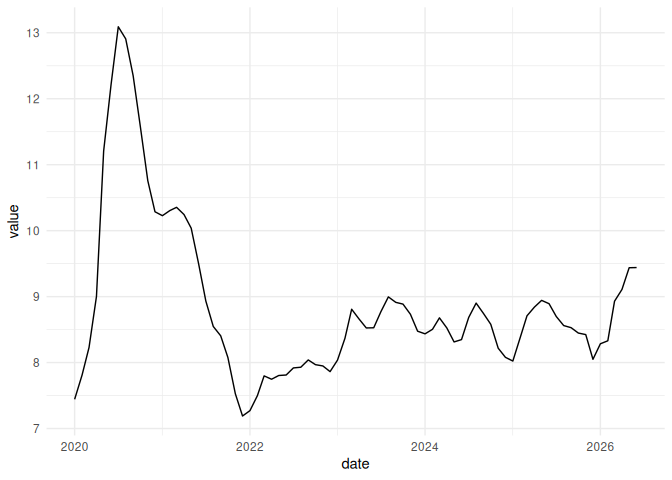

# bcchr

`bcchr` permite descubrir, describir y descargar series de la Base de
Datos Estadísticos del Banco Central de Chile desde R.

La interfaz principal usa nombres simples en `snake_case` y devuelve
tibbles con columnas consistentes. Las funciones de bajo nivel que
reflejan directamente las operaciones oficiales `GetSeries` y
`SearchSeries` siguen disponibles por compatibilidad.

Más información sobre la API del Banco Central en
<https://si3.bcentral.cl/estadisticas/Principal1/web_services/index.htm>.

## Instalación

``` r

# install.packages("devtools")
devtools::install_github("jbkunst/bcchr")
```

## Autenticación

La API REST del Banco Central requiere un token. Guárdelo en la variable
de entorno `BCCH_TOKEN`, por ejemplo en su archivo `.Renviron`:

``` text
BCCH_TOKEN=su_token
```

No guarde el token dentro de scripts ni lo suba a GitHub. Todos los
ejemplos que consultan directamente la API requieren que `BCCH_TOKEN`
esté configurado.

Puede verificar que R lo encuentre sin imprimirlo:

``` r

nzchar(Sys.getenv("BCCH_TOKEN"))
```

## Uso

### Ejemplo completo: tasa de desempleo

Supongamos que queremos obtener la tasa de desempleo de Chile. En la BDE
del Banco Central la serie se publica con el nombre **tasa de
desocupación**, por lo que primero buscamos candidatos con
[`resolve_series()`](https://jkunst.com/bcchr/reference/resolve_series.md):

``` r

library(bcchr)

# Requiere BCCH_TOKEN configurado; ver Autenticación.
candidatos <- resolve_series(
  "desocupacion",
  frequency = "MONTHLY"
)

candidatos |> head()
#> # A tibble: 6 × 8
#>   series_id              frequency spanish_title english_title first_observation
#>   <chr>                  <chr>     <chr>         <chr>         <date>           
#> 1 F049.DES.TAS.HIST.10.M MONTHLY   Tasas de des… Unemployment… 1986-02-01       
#> 2 F049.DES.TAS.INE.02.M  MONTHLY   Tasa de deso… Unemployment… 2010-03-01       
#> 3 F049.DES.TAS.INE.03.M  MONTHLY   Tasa de deso… Unemployment… 2010-03-01       
#> 4 F049.DES.TAS.INE.10.M  MONTHLY   Tasa de deso… Unemployment… 2010-03-01       
#> 5 F049.DES.TAS.INE.D02.M MONTHLY   Tasa de deso… Unemployment… 2010-03-01       
#> 6 F049.DES.TAS.INE.D03.M MONTHLY   Tasa de deso… Unemployment… 2010-03-01       
#> # ℹ 3 more variables: last_observation <date>, updated_at <date>,
#> #   created_at <date>
```

Entre los resultados está la serie nacional mensual no ajustada del INE,
`F049.DES.TAS.INE9.10.M`. Una vez que conocemos el código exacto,
podemos revisar su metadata:

``` r

serie <- "F049.DES.TAS.INE9.10.M"

describe_series(serie)
#> Consultando las 4 frecuencias del Banco Central; esto puede tardar unos
#> segundos.
#> # A tibble: 1 × 8
#>   series_id              frequency spanish_title english_title first_observation
#>   <chr>                  <chr>     <chr>         <chr>         <date>           
#> 1 F049.DES.TAS.INE9.10.M MONTHLY   Tasa de deso… Unemployment… 2010-03-01       
#> # ℹ 3 more variables: last_observation <date>, updated_at <date>,
#> #   created_at <date>
```

Luego descargamos las observaciones.
[`get_series()`](https://jkunst.com/bcchr/reference/get_series.md) no
interpreta nombres: recibe el código exacto y opcionalmente un rango de
fechas.

``` r

desempleo <- get_series(
  serie,
  from = "2020-01-01"
)

tail(desempleo)
#> # A tibble: 6 × 3
#>   date       value status_code
#>   <date>     <dbl> <chr>      
#> 1 2026-01-01  8.28 OK         
#> 2 2026-02-01  8.33 OK         
#> 3 2026-03-01  8.93 OK         
#> 4 2026-04-01  9.11 OK         
#> 5 2026-05-01  9.44 OK         
#> 6 2026-06-01  9.44 OK
```

Y para una visualización rápida:

``` r

plot_series(desempleo)
```



[`plot_series()`](https://jkunst.com/bcchr/reference/plot_series.md)
devuelve un objeto `ggplot`, por lo que puede seguir agregando capas o
temas de `ggplot2` normalmente.

### Explorar el catálogo completo

Cuando no tiene todavía un concepto específico para buscar,
[`metadata()`](https://jkunst.com/bcchr/reference/metadata.md) permite
revisar el catálogo disponible. Si conoce la frecuencia, indicarla evita
consultas innecesarias:

``` r

metadata("MONTHLY") |> head()
#> # A tibble: 6 × 8
#>   series_id           frequency spanish_title    english_title first_observation
#>   <chr>               <chr>     <chr>            <chr>         <date>           
#> 1 G073.IPC.IND.2018.M MONTHLY   IPC General his… Historical H… 1989-04-01       
#> 2 G073.IPC.IND.2023.M MONTHLY   General (empalm… Headline (CB… 1998-12-01       
#> 3 G073.IPC.V12.2018.M MONTHLY   IPC General his… Historical H… 1990-04-01       
#> 4 G073.IPC.V12.2023.M MONTHLY   General (empalm… Headline (CB… 1999-12-01       
#> 5 G073.IPC.VAR.2018.M MONTHLY   IPC General his… Historical H… 1989-05-01       
#> 6 G073.IPC.VAR.2023.M MONTHLY   General (empalm… Headline (CB… 1999-01-01       
#> # ℹ 3 more variables: last_observation <date>, updated_at <date>,
#> #   created_at <date>
```

Si no especifica una frecuencia,
[`metadata()`](https://jkunst.com/bcchr/reference/metadata.md) consulta
`DAILY`, `MONTHLY`, `QUARTERLY` y `ANNUAL`. El paquete informa este
comportamiento porque requiere cuatro requests. El mensaje puede
desactivarse para una llamada con `verbose = FALSE` o globalmente con:

``` r

options(bcchr.verbose = FALSE)
```

## API de bajo nivel

[`bcch_GetSeries()`](https://jkunst.com/bcchr/reference/bcch_GetSeries.md)
y
[`bcch_SearchSeries()`](https://jkunst.com/bcchr/reference/bcch_SearchSeries.md)
se mantienen para quienes necesiten trabajar directamente con las dos
operaciones oficiales del Banco Central y sus nombres de campos
originales. Para código nuevo se recomienda la interfaz
[`metadata()`](https://jkunst.com/bcchr/reference/metadata.md) /
[`resolve_series()`](https://jkunst.com/bcchr/reference/resolve_series.md)
/
[`describe_series()`](https://jkunst.com/bcchr/reference/describe_series.md)
/ [`get_series()`](https://jkunst.com/bcchr/reference/get_series.md).
